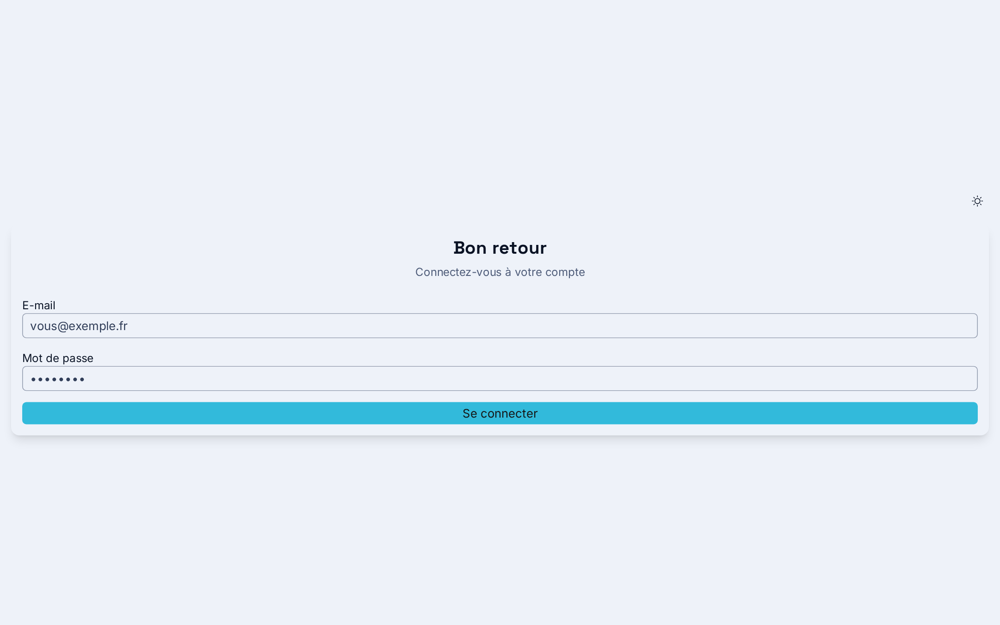
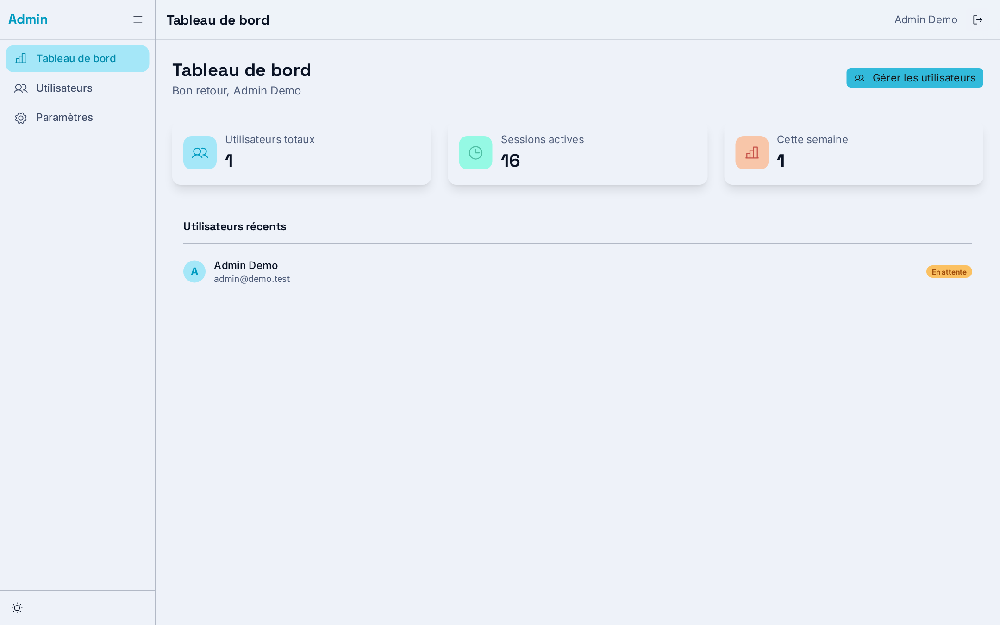
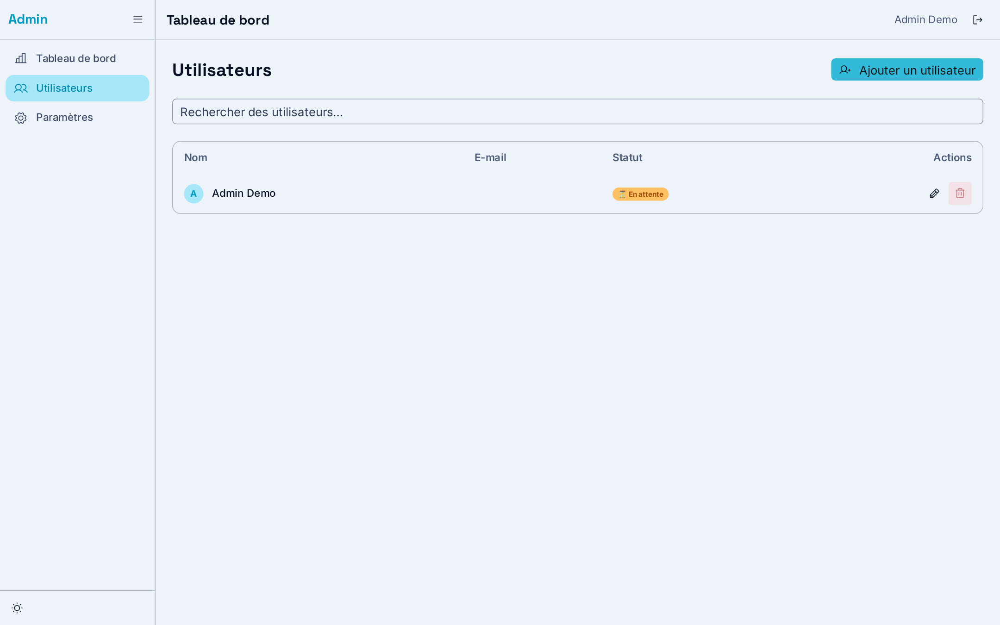

# SvelteForge

A `sv` community addon that scaffolds production-ready SvelteKit boilerplates powered by **Skeleton UI v5** and **Tailwind CSS v4**.

**Not a component library. Not a shadcn clone.** SvelteForge gives you the essentials — buttons, inputs, selects, cards, theme, SEO, layouts — so you start fast and own everything. Need richer components (dialogs, tabs, tooltips…)? Use the official `@skeletonlabs/skeleton-svelte` components directly. Need more? Pick 2–3 opt-in modules, not a framework.

## What SvelteForge adds to `sv create`

| | `sv create` (plain) | SvelteForge |
|---|---|---|
| SvelteKit + TypeScript + Vite | ✅ | ✅ |
| Theme (light/dark, oklch, fonts) | ❌ | ✅ |
| UI kit essentials (btn, input, card, badge, table, alert) | ❌ | ✅ |
| Layouts (navbar, footer, seo, sitemap) | ❌ | ✅ |
| Admin dashboard + auth + DB (dashboard template) | ❌ | ✅ |
| Test baseline (vitest / playwright) | ❌ | ✅ |
| i18n Paraglide FR/EN (compiler-first) | ❌ | ✅ |
| AI-ready AGENTS.md scaffolded | ❌ | ✅ |

## Screenshots

**Login** | **Dashboard admin**
:---:|:---:
 | 

**User management**



> Screenshots are generated from a fresh scaffold of the dashboard template.

## Quick Start

```bash
# Base template — UI kit, layouts, theme, forms
npx sv create my-project --template minimal --types ts --add svforge --install bun --no-download-check

# Dashboard template — base + auth + admin + DB
npx sv create my-project --template minimal --types ts --add 'svforge=template:dashboard' --install bun --no-download-check
```

Then:

```bash
cd my-project
bun dev
```

## Templates

| Template | Description |
|----------|-------------|
| `base` | UI kit essentials + layouts + theme + SEO + dark mode |
| `dashboard` | Base + admin dashboard + Better Auth + Drizzle ORM + user management |

### Dashboard testing profiles

The dashboard template includes a **Vitest baseline** by default (`bun run test`).
An opt-in **Playwright** profile adds full browser E2E tests:

```bash
# Dashboard with Playwright E2E profile
npx sv create my-project --template minimal --types ts --add 'svforge=template:dashboard+testing:playwright' --install bun --no-download-check
cd my-project && npx playwright install && bun run test:e2e
```

## Modules

| Package | What it adds | Requires |
|---------|-------------|----------|
| `@svforge/ui_toast` | Toast notifications (Skeleton Toast) | base |
| `@svforge/dnd` | Drag & drop sortable lists (@thisux/sveltednd) | base |
| `@svforge/tiptap` | Rich text editor (Tiptap) | base |
| `@svforge/graph` | Knowledge graph visualization (force-graph) | base |
| `@svforge/email` | Transactional emails (Resend) | base |
| `@svforge/oauth` | Social auth (Google, GitHub) | **dashboard** |
| `@svforge/uploads` | File uploads (S3/R2, presigned) | base |
| `@svforge/blog` | Blog/CMS (MDsveX) | base |

Install modules into an existing project:

```bash
npx sv add @svforge/ui_toast
npx sv add @svforge/tiptap
```

For anything else, reach for [`@skeletonlabs/skeleton-svelte`](https://skeleton.dev) — 30+ production components (accordion, tabs, dialog, date-picker…) that pair naturally with the base kit.

## Architecture

- **Model**: shadcn/ui style — source files are copied into the target project, not imported from node_modules. You own the code.
- **Monorepo**: Bun workspaces, one package per module
- **Build**: `tsdown` bundles each addon into a single ESM file; `prebuild` embeds template files as strings
- **Base is intentionally small**: essentials only — richer components come from Skeleton
- **Design-system harness (#240)**: every scaffold ships `svforge-catalog.json` (machine-readable catalog) + `svforge-check.mjs` (`node svforge-check.mjs` — flags second UI kits and duplicated Skeleton primitives as ERROR)

## Development

```bash
bun install              # Install dependencies
bun run build            # Build svforge (prebuild + tsdown)
bun run build:all        # Build every package
bun run test             # Run the test suite
```

### Build a single module

```bash
cd packages/graph && bun run build
```

### Test locally (no npm publish)

```bash
cd packages/svforge && bun run build && bun scripts/test-local.ts base /tmp/sf-test
cd /tmp/sf-test && bun install && bun dev
```

### Full scaffold check

```bash
bash scripts/test-scaffold.sh base        # real sv create + sv add + build
bash scripts/test-scaffold.sh dashboard
```

See `CONTRIBUTING.md` for the TDD workflow (Red → Green → Refactor) and `AGENTS.md` for repo conventions.

## Tech Stack

- **Svelte 5** (runes) + **SvelteKit 2**
- **Skeleton UI v5** (design system) — see [skeleton.dev](https://skeleton.dev)
- **Tailwind CSS v4**
- **TypeScript**, **Bun**
- **Better Auth** + **Drizzle ORM** (dashboard template)

## License

MIT

## Links

- **Source & docs**: [github.com/lelabdev/svelteforge](https://github.com/lelabdev/svelteforge)
- **Skeleton UI**: [skeleton.dev](https://skeleton.dev)
- **Svelte**: [svelte.dev](https://svelte.dev)
